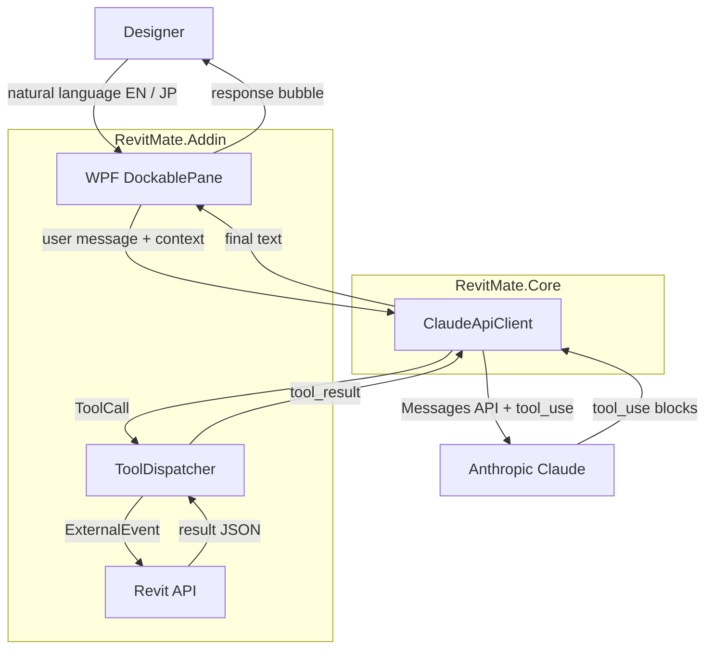

# RevitMate

> *Your drafting mate inside Revit, powered by Claude.*

RevitMate is an Autodesk Revit 2026 add-in that lets MEP electrical designers issue natural-language commands — in **English or Japanese** — and have Claude translate them into safe, parameterised Revit API operations.

---

## Screenshots

| Chat panel | Selection pin | Tool-use trace |
|---|---|---|
| *(screenshot placeholder)* | *(screenshot placeholder)* | *(screenshot placeholder)* |

---

## Tech Stack

| Layer | Technology |
|---|---|
| Runtime | .NET 8 (`net8.0-windows`, x64) |
| Host | Autodesk Revit 2026 (MEP) |
| Revit integration | Revit API 2026 (`RevitAPI.dll`, `RevitAPIUI.dll`) |
| AI model | Anthropic Claude API — `claude-sonnet-4-5` |
| HTTP / JSON | `HttpClient`, `Newtonsoft.Json` 13.x |
| UI | WPF hosted in a Revit `DockablePane` |
| Localisation | `System.Resources` `.resx` (EN default + JP) |

---

## Solution Layout

| Project | Purpose |
|---|---|
| `RevitMate.Core` | Claude API client, tool schemas, shared models. No Revit references — fully unit-testable. |
| `RevitMate.Addin` | `IExternalApplication`, ribbon commands, WPF dockable pane, Revit executor. |
| `RevitMate.ConsoleTest` | Standalone smoke test for the Claude API round-trip (no Revit required). |
| `RevitMate.Resources` | Shared `.resx` string resources for EN/JP localisation. |

---

## Installation

### Prerequisites

- Windows 10 / 11
- .NET SDK 8.0 (`dotnet --list-sdks` should show `8.0.x`)
- Autodesk Revit 2026 installed at the default path  
  `C:\Program Files\Autodesk\Revit 2026\`
- An Anthropic API key

### Build

```powershell
git clone <repo-url>
cd RevitMate
dotnet restore RevitMate.sln
dotnet build RevitMate.sln -c Release
```

### Deploy to Revit

1. Copy `RevitMate.Addin\bin\Release\net8.0-windows\` into  
   `%ProgramData%\Autodesk\Revit\Addins\2026\RevitMate\`  
   (or create a directory symlink during development).
2. Copy `RevitMate.addin` manifest to  
   `%ProgramData%\Autodesk\Revit\Addins\2026\`
3. Launch Revit 2026 and approve the add-in when prompted.

---

## Configuration

### Obtaining an Anthropic API Key

1. Create an account at [console.anthropic.com](https://console.anthropic.com).
2. Navigate to **API Keys** and click **Create Key**.
3. Copy the key (shown only once).

### Entering the Key in RevitMate

1. In Revit, open the **RevitMate** ribbon tab and click **Settings**.
2. Paste your API key into the **API Key** field.
3. Optionally choose a Claude model from the dropdown.
4. Click **Save**. The key is encrypted with Windows DPAPI and stored in  
   `%AppData%\RevitMate\settings.json` — it never leaves your machine in plain text.

---

## Usage Examples

### Use Case 1 — Place a Downlight Grid

> *Screenshot placeholder — chat panel showing the exchange below*

```
User:   Place a 3×4 grid of recessed downlights in the selected room.
Claude: ✓ Created 12 "Recessed Can Light" instances on Level 1.
        Grid spacing: 1 200 mm × 900 mm, inset 300 mm from walls.
```

Tools invoked: `get_selected_elements` → `get_room_info` → `create_light_fixture`

---

### Use Case 2 — Connect Fixtures to a Circuit (Japanese)

> *Screenshot placeholder — same panel with Japanese text*

```
User:   選択中の器具をパネルLP-1の回路3に接続して。
Claude: ✓ 12台の器具を回路 LP-1 / 3 に接続しました。
        接続後の合計負荷: 1 440 VA (定格 2 000 VA の 72%)
```

Tools invoked: `get_selected_elements` → `connect_to_circuit` → `get_circuit_info`

---

### Use Case 3 — Check Circuit Overload

> *Screenshot placeholder*

```
User:   Is circuit 3 on LP-1 overloaded?
Claude: Circuit LP-1 / 3 — 1 440 VA / 2 000 VA (72%). No overload.
        Headroom: 560 VA. Safe to add up to 4 more 100 W fixtures.
```

Tool invoked: `get_circuit_info`

---

## Architecture



### Available Tools

| # | Tool | Mutates model |
|---|---|---|
| 1 | `get_selected_elements` | No |
| 2 | `get_active_view_info` | No |
| 3 | `get_room_info` | No |
| 4 | `create_light_fixture` | Yes |
| 5 | `set_parameter` | Yes |
| 6 | `connect_to_circuit` | Yes |
| 7 | `get_circuit_info` | No |

Every mutating tool runs inside a named Revit `Transaction` so the user can **Ctrl+Z** any AI action as a single undo step.

---

## Roadmap

- [ ] Multi-discipline support (HVAC, plumbing, structural)
- [ ] Voice input (push-to-talk, EN/JP speech-to-text)
- [ ] Batch operations across multiple rooms or levels
- [ ] Additional languages (Chinese, Korean, Vietnamese)
- [ ] Safe-plan mode — wrap a full multi-tool plan in a `TransactionGroup` for atomic undo
- [ ] Richer model context (active level, view filters, recent edits)
- [ ] Team prompt-template library

---

## License

MIT License — see [LICENSE](./LICENSE).
