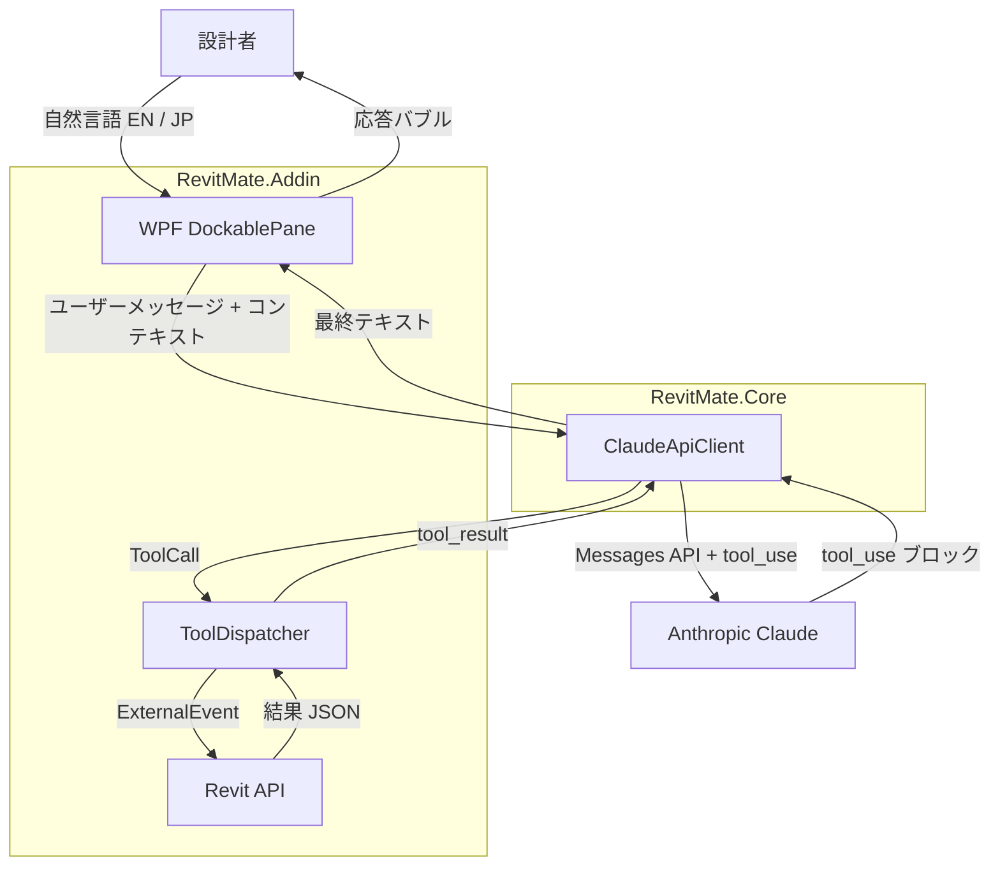

# RevitMate

> *Revit の中に常駐する、Claude 搭載の設計アシスタント。*

RevitMate は Autodesk Revit 2026 向けアドインです。MEP 電気設計者が**英語または日本語**で自然言語コマンドを入力するだけで、Claude がその意図を安全でパラメータ化された Revit API 操作へと変換します。

---

## スクリーンショット

| チャットパネル | 選択ピン | ツール実行トレース |
|---|---|---|
| *(スクリーンショット予定)* | *(スクリーンショット予定)* | *(スクリーンショット予定)* |

---

## 技術スタック

| レイヤー | 技術 |
|---|---|
| ランタイム | .NET 8 (`net8.0-windows`, x64) |
| ホストアプリ | Autodesk Revit 2026 (MEP) |
| Revit 連携 | Revit API 2026 (`RevitAPI.dll`, `RevitAPIUI.dll`) |
| AI モデル | Anthropic Claude API — `claude-sonnet-4-5` |
| HTTP / JSON | `HttpClient`, `Newtonsoft.Json` 13.x |
| UI | Revit `DockablePane` 内に WPF でホスト |
| 多言語対応 | `System.Resources` の `.resx` ファイル（EN デフォルト + JP） |

---

## ソリューション構成

| プロジェクト | 役割 |
|---|---|
| `RevitMate.Core` | Claude API クライアント、ツールスキーマ、共有モデル。Revit 参照なし — 単体テスト可能。 |
| `RevitMate.Addin` | `IExternalApplication`、リボンコマンド、WPF ドッキングペイン、Revit エグゼキューター。 |
| `RevitMate.ConsoleTest` | Revit なしで Claude API の疎通確認ができるコンソールテスト。 |
| `RevitMate.Resources` | EN/JP ローカライズ用の共有 `.resx` 文字列リソース。 |

---

## インストール

### 前提条件

- Windows 10 / 11
- .NET SDK 8.0（`dotnet --list-sdks` で `8.0.x` が表示されること）
- Autodesk Revit 2026（デフォルトパスにインストール済み）  
  `C:\Program Files\Autodesk\Revit 2026\`
- Anthropic API キー

### ビルド

```powershell
git clone https://github.com/themanh86/RevitMate.git
cd RevitMate
dotnet restore RevitMate.sln
dotnet build RevitMate.sln -c Release
```

### Revit へのデプロイ

1. `RevitMate.Addin\bin\Release\net8.0-windows\` の内容を以下のフォルダにコピーします。  
   `%ProgramData%\Autodesk\Revit\Addins\2026\RevitMate\`  
   （開発中はディレクトリシンボリックリンクが便利です）
2. `RevitMate.addin` マニフェストを以下にコピーします。  
   `%ProgramData%\Autodesk\Revit\Addins\2026\`
3. Revit 2026 を起動し、アドインの承認プロンプトで許可してください。

---

## 設定方法

### Anthropic API キーの取得

1. [console.anthropic.com](https://console.anthropic.com) でアカウントを作成します。
2. **API Keys** メニューから **Create Key** をクリックします。
3. 表示されたキーをコピーします（初回表示のみ）。

### RevitMate への API キー登録

1. Revit で **RevitMate** リボンタブを開き、**設定** ボタンをクリックします。
2. **API キー** フィールドにコピーしたキーを貼り付けます。
3. ドロップダウンで Claude モデルを選択します（任意）。
4. **保存** をクリックします。キーは Windows DPAPI で暗号化され、  
   `%AppData%\RevitMate\settings.json` に保存されます。平文でネットワークに送信されることはありません。

---

## 使用例

### ユースケース 1 — ダウンライトグリッドの配置

> *スクリーンショット予定 — 下記のやり取りを示すチャットパネル*

```
ユーザー:  選択した部屋に100Wのダウンライトを3×4のグリッドで配置して。
Claude:   ✓ 「Recessed Can Light」を12台、1階に作成しました。
           グリッド間隔: 1,200 mm × 900 mm、壁からのオフセット: 300 mm
```

使用ツール: `get_selected_elements` → `get_room_info` → `create_light_fixture`

---

### ユースケース 2 — 器具を回路に接続

> *スクリーンショット予定*

```
ユーザー:  選択中の器具をパネルLP-1の回路3に接続して。
Claude:   ✓ 12台の器具を回路 LP-1 / 3 に接続しました。
           接続後の合計負荷: 1,440 VA（定格 2,000 VA の 72%）
```

使用ツール: `get_selected_elements` → `connect_to_circuit` → `get_circuit_info`

---

### ユースケース 3 — 回路の過負荷チェック（英語コマンド）

> *スクリーンショット予定*

```
ユーザー:  Is circuit 3 on LP-1 overloaded?
Claude:   Circuit LP-1 / 3 — 1,440 VA / 2,000 VA (72%). No overload.
           Headroom: 560 VA. Safe to add up to 4 more 100 W fixtures.
```

使用ツール: `get_circuit_info`

---

## アーキテクチャ



### 利用可能なツール

| # | ツール | モデル変更 |
|---|---|---|
| 1 | `get_selected_elements` | なし |
| 2 | `get_active_view_info` | なし |
| 3 | `get_room_info` | なし |
| 4 | `create_light_fixture` | あり |
| 5 | `set_parameter` | あり |
| 6 | `connect_to_circuit` | あり |
| 7 | `get_circuit_info` | なし |

モデルを変更するツールはすべて名前付きの Revit `Transaction` 内で実行されるため、AI の操作を **Ctrl+Z** で1ステップずつ取り消せます。

---

## ロードマップ

- [ ] 多分野対応（HVAC、配管、構造）
- [ ] 音声入力（プッシュトゥトーク、EN/JP 音声認識）
- [ ] 複数部屋・複数階にわたるバッチ処理
- [ ] 追加言語対応（中国語、韓国語、ベトナム語）
- [ ] セーフプランモード — マルチツール計画全体を `TransactionGroup` でラップし、アトミックな取り消しを実現
- [ ] リッチなモデルコンテキスト（アクティブレベル、ビューフィルター、最近の編集履歴）
- [ ] チーム用プロンプトテンプレートライブラリ

---

## ライセンス

MIT License — [LICENSE](./LICENSE) を参照してください。
